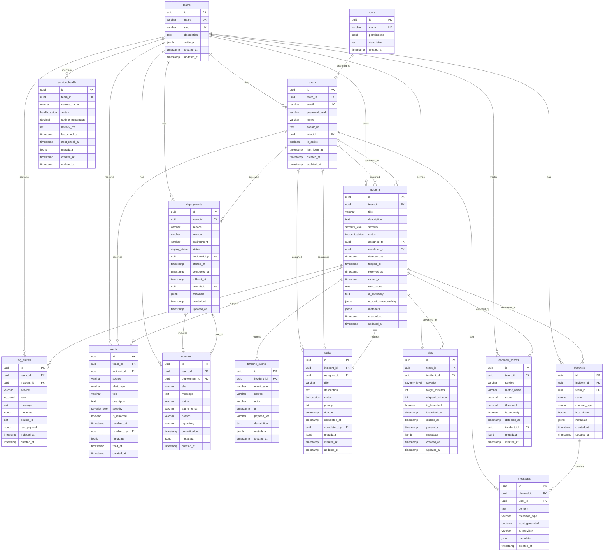

# ERD — SENTINEL Data Model

## Entity Relationship Diagram

## Enums

| Enum | Values |
|------|--------|
| severity_level | SEV1, SEV2, SEV3, SEV4 |
| incident_status | detected, triaging, investigating, mitigating, resolved, closed |
| log_level | debug, info, warn, error, fatal |
| health_status | healthy, degraded, down, unknown |
| deploy_status | pending, in_progress, success, failed, rolled_back |
| task_status | pending, in_progress, blocked, completed, cancelled |

## Key Design Decisions

1. **UUID Primary Keys**: All entities use UUID for distributed system compatibility
2. **Provenance Columns**: `source`, `actor`, `ts` on TimelineEvent for immutable audit trail
3. **Soft References**: Some FKs use SET NULL to preserve data when references are deleted
4. **JSONB Metadata**: Flexible schema extension without migrations
5. **Timestamps**: All entities have `created_at`; mutable entities have `updated_at` with auto-trigger
6. **Team Scoping**: All data is scoped to teams for multi-tenant isolation
7. **Full-Text Search**: pg_trgm extension on log_entries.message for efficient text search

## Indexes

- All foreign keys are indexed
- Time-based queries optimized with DESC indexes on timestamps
- Text search enabled with trigram indexes
- Status fields indexed for filtering
